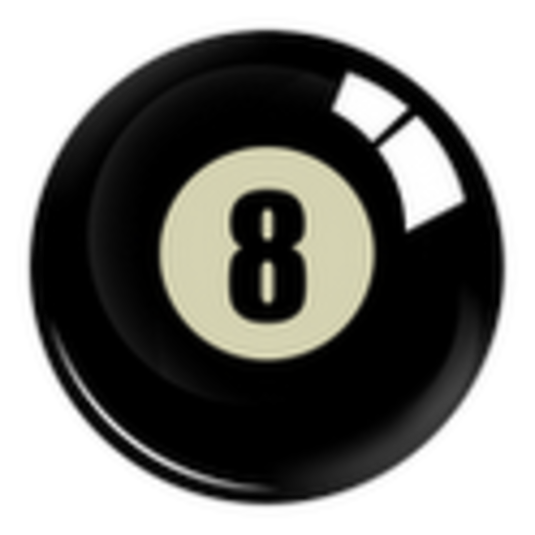

<h1 align="center">
  MAGIC 8 BALL
</h1>

<h4 align="center">
  
</h4>

***Magic 8 ball*** (рус. магический шар 8) - игрушка, шуточный способ предсказывать будущее.

Ответы выдаются в формате «да», «нет», «абсолютно точно», «плохие шансы», «вопрос не ясен», и т. д. Всего 20 вариантов ответов.

---

## Использование

С установленным [Ruby](https://www.ruby-lang.org/en/downloads/), задайте вопрос и запустите скрипт в терминале (Linux, MacOS) или в командной строке (Windows)

    $ ruby magic_ball.rb

  

---

## Смотрите также

Информация в Wikipedia [`wiki`](https://ru.wikipedia.org/wiki/Magic_8_ball)

---

## Лицензия

MIT
